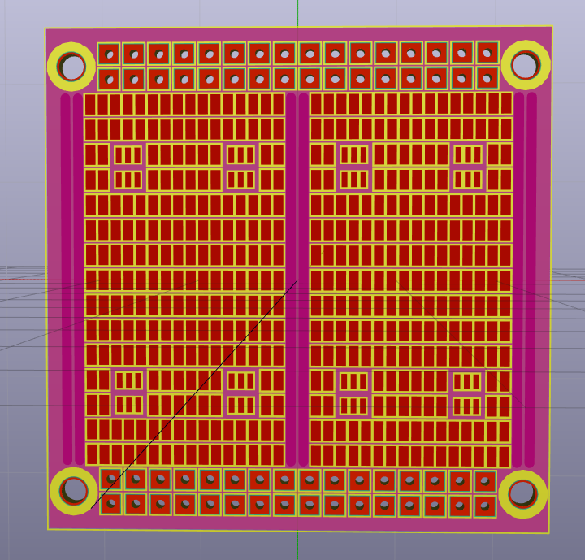

# miniboard-protoboard
This is a general purpose SMD prototyping board.

Small, cheap to manufature.

It fits most common hand solderable SMD packages :
* 1.27mm SOIC
* SOT-23-x
* SOT-89 
* All resistor / capacitors / 2-pin components up to 0402 size (Why would you prototype with 0402 is an other question)

A ground plane covers the whole back of the board
